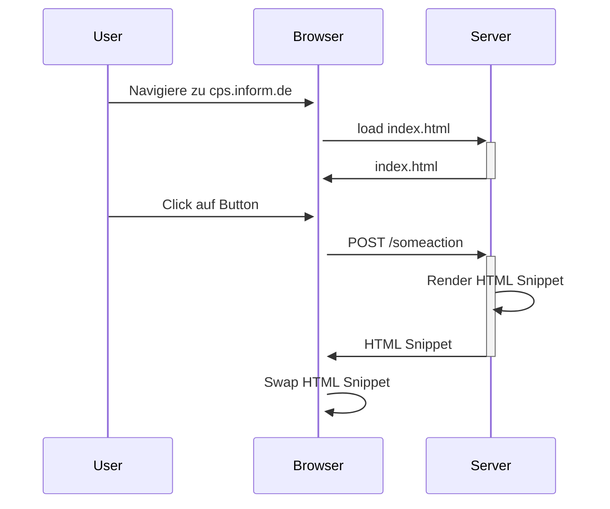

# Vorraussetzungen

- JDK 21+
- Gradle (IntelliJ regelt)
- Browser mit Devtools

---
layout: two-cols-header
---

# Intro und Überblick

::left::



::right::

<v-clicks>

- User navigiert zu Seite
- Browser requested HTML
- Server antwortet mit gesamter Seite
- User Clickt auf Button und HTMX macht AJAX Post
- Server rendert und Antwortet mit einem HTMl Snippet
- HTMX Swapped DOM Nodes

</v-clicks>

---

# Beispiel

<v-clicks>

```html
<!-- Initial HTML vom Server -->
<div id="counter">Count: 0</div>
<button hx-post="/increment" 
        hx-target="#counter"
        hx-swap="innerHTML">
  Increment
</button>
```

**Server Response (HTML Snippet):**

```html
Count: 1
```

**Result:** HTMX ersetzt nur den Inhalt von `#counter`, keine komplette Page Reload!

</v-clicks>


---

# Technische Details

<v-clicks>

- **Dateigröße**: ~14kb minified + gzipped
  - Zum Vergleich: React ~40kb+, Vue ~30kb+
- **Browser-Kompatibilität**: Alle modernen Browser (IE11+)
- **Installation**: 
  - Via CDN (kein Build-Step notwendig)
  - Via npm/yarn für Build-Prozesse
- **Performance**: 
  - Weniger JavaScript → Schnelleres Parsing
  - Server-Side Rendering → Schnellere First Paint
  - Weniger Bundle-Size → Schnellere Downloads

</v-clicks>

---

# Philosophie & Konzepte

<v-clicks>

**HATEOAS** (Hypermedia as the Engine of Application State)
- Server kontrolliert Navigation und UI-Zustand durch Hypermedia (HTML)
- Client muss keine Business-Logik kennen

**Locality of Behavior** 
- Code ist dort wo er gebraucht wird - direkt im HTML
- Keine Trennung zwischen Markup und Verhalten über Dateien hinweg

**Progressive Enhancement**
- Funktioniert ohne JavaScript (Fallback auf normale Forms)
- JavaScript erweitert die Funktionalität schrittweise
- Graceful Degradation automatisch

</v-clicks>

---

# Kombinierbarkeit mit JavaScript

**Interactive Islands Pattern**

```html
<!-- HTMX für Datenaustausch -->
<div hx-get="/products" hx-trigger="load">
  <!-- Alpine.js für lokale Interaktivität -->
  <div x-data="{ count: 0 }">
    <button @click="count++">Count: <span x-text="count"></span></button>
  </div>
</div>
```

- HTMX übernimmt Server-Kommunikation
- Alpine.js, Vanilla JS für lokale UI-Logik
- Best of both worlds: Server-State + Client-State
- Bibliotheken wie Alpine.js, Petite-Vue, _hyperscript perfekt kombinierbar


---

# SPA vs. MPA vs. HTMX Hybrid

<div class="grid grid-cols-3 gap-4 text-sm">

<div>

**SPA** 
(React, Vue, Angular)

<v-clicks>

✅ Sehr interaktiv  
✅ App-like Feel  
✅ Client-State Management

❌ Große Bundle-Size  
❌ Komplexer Build  
❌ SEO Herausforderungen  
❌ Hohe Komplexität

</v-clicks>

</div>

<div>

**MPA** 
(Traditional Server-Side)

<v-clicks>

✅ Einfach  
✅ SEO-friendly  
✅ Schnelle First Paint

❌ Page Reloads  
❌ Kein State  
❌ Langsames UX

</v-clicks>

</div>

<div>

**HTMX Hybrid**

<v-clicks>

✅ Partial Updates  
✅ Einfachheit  
✅ SEO-friendly  
✅ Progressive Enhancement  
✅ Kleine Bundle-Size

⚠️ Weniger für hochinteraktive Apps  
⚠️ Server-Rendering notwendig

</v-clicks>

</div>

</div>

---

# HTMX Request Attribute

<v-clicks>

- `hx-get`, `hx-post`, `hx-put`, `hx-patch`, `hx-delete` - HTTP Methode & URL
- `hx-trigger` - Welches Event löst den Request aus (default: `click` bei Button, `change` bei Input)
- `hx-include` - Zusätzliche Elemente in Request einbeziehen
- `hx-params` - Welche Parameter sollen mitgeschickt werden
- `hx-target` - Welches Element wird aktualisiert (default: Element selbst)
- `hx-swap` - Wie wird der Content eingefügt (`innerHTML`, `outerHTML`, `beforebegin`, `afterend`, etc.)
- `hx-swap-oob` - Out-of-Band Swaps für mehrere Elemente gleichzeitig
- `hx-indicator` - Loading Indicator anzeigen während Request läuft
- `hx-confirm` - Bestätigungsdialog vor Request anzeigen

</v-clicks>

---

# HTMX Response Attribute

<v-clicks>

- `HX-Trigger` - Löst Events auf dem Client aus nach Response
- `HX-Retarget` - Ändert das Ziel-Element für den Swap
- `HX-Reswap` - Ändert die Swap-Strategie für die Response
- `HX-Redirect` - Führt einen Client-seitigen Redirect durch
- `HX-Refresh` - Refresht die komplette Seite
- `HX-Location` - Client-seitiger Redirect mit HTMX Request
- `HX-Push-Url` - Updated die Browser URL (History API)
- `HX-Replace-Url` - Ersetzt die Browser URL ohne History Eintrag

</v-clicks>

---

# HTMX Request & Response Header

<div class="grid grid-cols-2 gap-8">

<div>

**Request Header (Browser → Server):**

<v-clicks>

- `HX-Request: true` - Kennzeichnet HTMX Request
- `HX-Trigger` - ID des auslösenden Elements
- `HX-Trigger-Name` - Name des auslösenden Elements
- `HX-Target` - ID des Ziel-Elements
- `HX-Current-URL` - Aktuelle URL im Browser
- `HX-Prompt` - Wert aus Prompt Dialog

</v-clicks>

</div>

<div>

**Response Header (Server → Browser):**

<v-clicks>

- `HX-Trigger` - Events triggern nach Swap
- `HX-Redirect` - Client-Redirect durchführen
- `HX-Refresh` - Seite neu laden
- `HX-Push-Url` - URL in History pushen
- `HX-Retarget` - Anderes Ziel wählen
- `HX-Reswap` - Swap-Methode ändern

</v-clicks>

</div>

</div>

---

# Request Lifecycle im Detail
HTMX Request und Swapping Events

<v-clicks>

**1. htmx:beforeRequest** - Vor dem Request, kann abgebrochen werden

**2. htmx:beforeSend** - Request wird gesendet, kann modifiziert werden

**3. Request läuft** - AJAX Request zum Server

**4. htmx:beforeSwap** - Response erhalten, vor DOM Update, kann abgebrochen werden

**5. htmx:beforeOnLoad** - DOM Update steht bevor

**6. htmx:afterSwap** - Content wurde ausgetauscht

**7. htmx:afterSettle** - Animations/Transitions abgeschlossen

**8. htmx:afterRequest** - Gesamter Prozess abgeschlossen

Jedes Event bietet Zugriff auf Request/Response Details für Custom Logic.

</v-clicks>

---

# Swap Strategien

<v-clicks>

```html
<div id="target">Aktueller Inhalt</div>
```

- **`innerHTML`** (default) - Ersetzt Inhalt: `<div id="target">Neuer Inhalt</div>`
- **`outerHTML`** - Ersetzt komplettes Element: `<section>Neuer Inhalt</section>`
- **`beforebegin`** - Vor Element einfügen: `<p>Neu</p><div id="target">...</div>`
- **`afterbegin`** - Am Anfang des Inhalts: `<div id="target"><p>Neu</p>Alt...</div>`
- **`beforeend`** - Am Ende des Inhalts: `<div id="target">...Alt<p>Neu</p></div>`
- **`afterend`** - Nach Element einfügen: `<div id="target">...</div><p>Neu</p>`
- **`delete`** - Element entfernen
- **`none`** - Kein Swap (nur Events/Side-Effects)

```html
<button hx-get="/item" hx-target="#list" hx-swap="beforeend">
  Item hinzufügen
</button>
```

</v-clicks>

---

# hx-target Selektoren

<v-clicks>

**CSS Selektoren:**
```html
<button hx-get="/data" hx-target="#result">Standard CSS</button>
<button hx-get="/data" hx-target=".results">Class Selector</button>
<button hx-get="/data" hx-target="[data-area='main']">Attribute</button>
```

**Relative Selektoren:**
```html
<!-- this: Element selbst (default) -->
<div hx-get="/reload" hx-target="this">Reload</div>
<!-- closest: Nächstes Parent-Element -->
<button hx-get="/update" hx-target="closest tr">Update Row</button>
<!-- next: Nächstes Geschwister-Element -->
<button hx-get="/more" hx-target="next .content">Next</button>
<!-- previous: Vorheriges Geschwister-Element -->
<button hx-get="/back" hx-target="previous .content">Previous</button>
<!-- find: Suche innerhalb des Elements -->
<div hx-get="/data" hx-target="find .result">
  <div class="result"></div>
</div>
```

</v-clicks>

---

# htmx-spring-boot für mehr mentale Gesundkeit

```kotlin
implementation("io.github.wimdeblauwe:htmx-spring-boot:5.0.0")
implementation("io.github.wimdeblauwe:htmx-spring-boot-thymeleaf:5.0.0")
```

--- 

# Routing spezifisch für HTMX und Zugriff auf HtmxRequest

<v-clicks>

```java
@HxRequest
@GetMapping("/users")
public String users() {
    return "view";
}
```

```java
@HxRequest
@GetMapping("/users")
public String users(HtmxRequest htmxRequest) {
    if (htmxRequest.isHistoryRestoreRequest()) {
        // do something
    }
    return "view";
}
```

</v-clicks>

---

# Fragment Rendering für MVC und Thymeleaf

<v-clicks>

```java
@HxRequest
@GetMapping("/users")
public View users(Model model) {
    model.addAttribute("users", userRepository.findAll());
    model.addAttribute("count", userRepository.count());

    return FragmentsRendering
        .with("users/list")
        .fragment("users/count")
        .build();
}
```

```java
@HxRequest
@GetMapping("/users")
public View users(Model model) {
    model.addAttribute("users", userRepository.findAll());
    model.addAttribute("count", userRepository.count());

    return FragmentsRendering
            .with("users :: list")
            .fragment("users :: count")
            .build();
}
```

</v-clicks>

---

# Zugriff auf HtmxResponse

```java
@HxRequest
@PostMapping("/user/{id}")
public String user(@PathVariable Long id, @ModelAttribute @Valid UserForm form, 
                 BindingResult bindingResult, HtmxResponse htmxResponse) {

    if (bindingResult.hasErrors()) {
        return "user/form";
    }

    // update user ...
    htmxResponse.addTrigger("user-updated");
    
    return "redirect:htmx:/user/list";
}
```

---

# Übung 1 - Warmup

Baut eine kleine HTMX App mit Thymeleaf und Spring MVC
