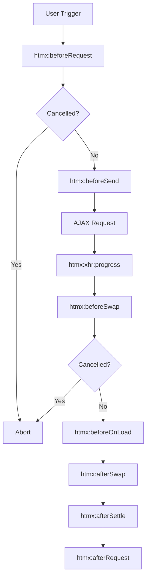

# HTMX Events & Advanced Patterns

---

# HTMX Event System

HTMX bietet ein umfangreiches Event System für interaktive Anwendungen

<v-clicks>

**Drei Event-Kategorien:**

1. **Request Lifecycle Events** - `htmx:beforeRequest`, `htmx:afterRequest`, etc.
2. **Custom Events** - Eigene Events triggern und empfangen
3. **Response Events** - Events vom Server gesteuert

**Warum wichtig?**
- Volle Kontrolle über Request/Response Lifecycle
- Integration mit bestehendem JavaScript
- Custom Loading States, Validierung, Analytics
- Fehlerbehandlung und User Feedback

</v-clicks>

---

# Event Lifecycle Übersicht



<v-clicks>

Jedes Event kann abgehört und modifiziert werden!

</v-clicks>

---

# Event Listener in JavaScript

<v-clicks>

**Basis Pattern:**
```javascript
document.body.addEventListener('htmx:beforeRequest', (event) => {
  console.log('Request startet:', event.detail);
  
  // Request abbrechen:
  // event.preventDefault();
});
```

**Event Detail Objekt:**
```javascript
{
  elt: HTMLElement,        // Das auslösende Element
  xhr: XMLHttpRequest,     // Das XHR Objekt
  target: HTMLElement,     // Das Ziel-Element
  requestConfig: Object,   // Request Konfiguration
  // ... weitere Properties je nach Event
}
```

</v-clicks>

---

# Praktisches Beispiel: Global Loading

<v-clicks>

```html
<div id="global-loader" style="display: none;">
  🔄 Loading...
</div>
```

```javascript
let activeRequests = 0;

document.body.addEventListener('htmx:beforeRequest', () => {
  activeRequests++;
  document.getElementById('global-loader').style.display = 'block';
});

document.body.addEventListener('htmx:afterRequest', () => {
  activeRequests--;
  if (activeRequests === 0) {
    document.getElementById('global-loader').style.display = 'none';
  }
});
```

Funktioniert für **alle** HTMX Requests automatisch! 🎉

</v-clicks>

---

# Request Modifikation

<v-clicks>

**Headers hinzufügen/ändern:**
```javascript
document.body.addEventListener('htmx:configRequest', (event) => {
  // Auth Token hinzufügen
  event.detail.headers['Authorization'] = 'Bearer ' + getToken();
  
  // Parameter hinzufügen
  event.detail.parameters['userId'] = getCurrentUserId();
  
  // URL ändern
  event.detail.path = event.detail.path + '?v=2';
});
```

**Request abbrechen:**
```javascript
document.body.addEventListener('htmx:beforeRequest', (event) => {
  if (!isUserLoggedIn()) {
    event.preventDefault();
    showLoginDialog();
  }
});
```

</v-clicks>

---

# Response Handling

<v-clicks>

**Swap anpassen vor Update:**
```javascript
document.body.addEventListener('htmx:beforeSwap', (event) => {
  // Status Code prüfen
  if (event.detail.xhr.status === 404) {
    event.detail.shouldSwap = true; // Trotzdem swappen
    event.detail.target = document.getElementById('error-area');
  }
  
  // Response modifizieren
  if (event.detail.xhr.status === 200) {
    const data = JSON.parse(event.detail.xhr.response);
    console.log('Server returned:', data);
  }
});
```

</v-clicks>

---

# Custom Events Triggern

<v-clicks>

**Vom Server via HX-Trigger Header:**
```java
@GetMapping("/save")
public ResponseEntity<String> save() {
    // ... save logic
    return ResponseEntity.ok()
        .header("HX-Trigger", "itemSaved")
        .body("<div>Saved!</div>");
}
```

```javascript
document.body.addEventListener('itemSaved', () => {
  showNotification('Item wurde gespeichert!');
  refreshDashboard();
});
```

**Komplexe Events mit JSON:**
```java
.header("HX-Trigger", "{\"showMessage\": {\"level\": \"success\", \"text\": \"Saved!\"}}")
```

</v-clicks>

---

# HX-Trigger Header Varianten

<v-clicks>

**Timing Control:**

```java
// Sofort nach Response
.header("HX-Trigger", "myEvent")

// Nach DOM Swap
.header("HX-Trigger-After-Swap", "myEvent")

// Nach Settle (Animationen fertig)
.header("HX-Trigger-After-Settle", "myEvent")
```

**Multiple Events:**
```java
.header("HX-Trigger", "event1, event2, event3")
```

**Mit Event Details:**
```java
.header("HX-Trigger", "{\\"refresh\\": {\\"id\\": 123}, \\"notify\\": {\\"msg\\": \\"Done!\\"}}")
```

</v-clicks>

---

# Event-Driven Patterns

<v-clicks>

**Pattern 1: Cross-Component Communication**
```html
<!-- Component A triggers save -->
<button hx-post="/save/item">Save</button>

<!-- Component B listens and reloads -->
<div hx-get="/items/list" 
     hx-trigger="itemSaved from:body">
</div>
```

```java
// Server sendet Event
return ResponseEntity.ok()
    .header("HX-Trigger", "itemSaved")
    .body(html);
```

🎯 Komponenten kommunizieren über Events statt direkten DOM-Zugriff!

</v-clicks>

---

# Advanced Pattern: Event Chaining

<v-clicks>

```html
<!-- Schritt 1: Upload -->
<form hx-post="/upload" 
      hx-target="#result">
  <input type="file" name="file">
  <button type="submit">Upload</button>
</form>

<!-- Schritt 2: Process (triggered by upload) -->
<div hx-post="/process"
     hx-trigger="fileUploaded from:body"
     hx-target="#status">
</div>

<!-- Schritt 3: Notify (triggered by process) -->
<div hx-get="/summary"
     hx-trigger="processingComplete from:body"
     hx-target="#summary">
</div>
```

Server sendet jeweils passende Events! 🔗

</v-clicks>

# Debouncing & Throttling

<v-clicks>

**Problem:** Zu viele Requests bei schneller User-Eingabe

**Debouncing:** Wartet bis User fertig ist
```html
<input type="search" 
       hx-get="/search"
       hx-trigger="keyup changed delay:500ms"
       hx-target="#results"
       placeholder="Search...">
```

**Throttling:** Maximal ein Request pro Zeiteinheit
```html
<div hx-get="/scroll-data"
     hx-trigger="scroll throttle:1s"
     hx-target="#content">
</div>
```

</v-clicks>

---

# Trigger Modifiers

<v-clicks>

```html
<!-- Nur wenn value sich ändert -->
<input hx-get="/check" hx-trigger="keyup changed">

<!-- Delay: Debouncing -->
<input hx-get="/search" hx-trigger="keyup delay:300ms">

<!-- Throttle: Rate Limiting -->
<div hx-get="/data" hx-trigger="scroll throttle:1s">

<!-- Once: Nur einmal triggern -->
<div hx-get="/init" hx-trigger="load once">

<!-- From: Event von anderem Element -->
<button hx-get="/data" hx-trigger="click from:#otherBtn">

<!-- Mehrere Trigger kombinieren -->
<input hx-get="/save" 
       hx-trigger="keyup changed delay:1s, blur">
```

</v-clicks>

---

# Übung 5: Live Search mit Events

**Erstelle eine Live Search mit HTMX Events:**

<v-clicks>

**Requirements:**
1. **Live Search** mit Debouncing (300ms)
2. **Loading Indicator** während der Suche
3. **Result Counter** (zeigt Anzahl Ergebnisse)
4. **Search History** (letzte 5 Suchen)
5. **Clear Button** erscheint nur wenn Text eingegeben

**Bonus:**
- Search Analytics (wie oft wurde gesucht, durchschnittliche Dauer) mithilfe von Sessions

</v-clicks>

---

# Übung 5: Technische Hints

<v-clicks>

**Events die du brauchst:**
- `htmx:beforeRequest` - Loading State setzen
- `htmx:afterRequest` - Loading State entfernen
- `htmx:afterSwap` - Result Counter aktualisieren
- Custom Event `searchCompleted` - History aktualisieren

**Nützliche Trigger:**
```html
hx-trigger="keyup changed delay:300ms"
```

**OOB Swaps für Multiple Updates:**
```html
<div id="results">...</div>
<div id="count" hx-swap-oob="true">5 results</div>
```

</v-clicks>
