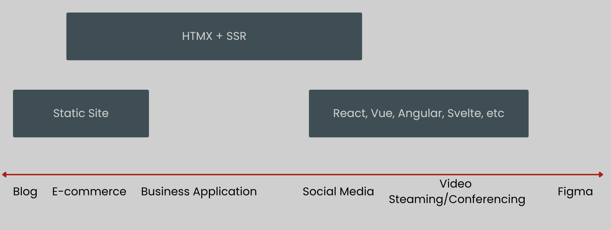

---
# try also 'default' to start simple
theme: default
title: HTMX Workshop
class: text-center
# https://sli.dev/features/drawing
drawings:
  persist: true
transition: slide-left
mdc: true
---

# HTMX Workshop


<!-- 
- high powered tools for html
- Vorstellungsrunde
-->

---

# Was ist HTMX

"High powered toosl for HTML"

```html
<button hx-get="/api/data" hx-target="#result">
  Load Data
</button>
<div id="result"></div>
```
<br/>
<br/>

<v-clicks>

- HTTP Request auf getriggert durch jedes event
- auf jedem HTML element
- sehr simpel auf der Clientseite
- Komplexer auf der Serverseite

</v-clicks>

<!-- 
- 
 -->

---

# Warum HTMX


<v-clicks>

- **Einfachheit**: HTML schreiben statt JavaScript
- **Server-Side Rendering**: Volle Kontrolle über HTML-Generierung
- **Weniger JavaScript**: Kleinerer Bundle, weniger Komplexität
- **Progressive Enhancement**: Funktioniert mit bestehenden Frameworks
- **Hypermedia-Driven**: REST-Prinzipien konsequent umgesetzt

</v-clicks>


--- 

# Der alte Weg

```html
<form action="/contact" method="POST">
  <input name="email" type="email" />
  <button type="submit">Subscribe</button>
</form>
```

<v-clicks>

**Problem:** Komplette Seite wird neu geladen ↻

**SPA-Lösung:** React/Vue + REST API + JSON + Client-Side Rendering


```jsx
const [email, setEmail] = useState('')

const handleSubmit = async (e) => {
  e.preventDefault()
  const response = await fetch('/api/contact', {
    method: 'POST',
    headers: { 'Content-Type': 'application/json' },
    body: JSON.stringify({ email })
  })
  const data = await response.json()
  // Update DOM manually
}
```

</v-clicks>

---

# Mit HTMX

<v-clicks>

```html
<form hx-post="/contact" hx-target="#message">
  <input name="email" type="email" />
  <button type="submit">Subscribe</button>
</form>

<div id="message"></div>
```

**Server antwortet mit HTML:**

```html
<div class="success">
  ✓ Vielen Dank! Sie haben sich erfolgreich angemeldet.
</div>
```

</v-clicks>

---

# Wo ist HTMX nützlich?
<br />
<br />



---

# Workshop Überblick Tag 1

**9:30 - 10:00** Intro und Überblick
- HTMX Attribute
- Request Lifecyle
- Request und Response Header

**10:30 - 10:45** Kleine Warmup-Übung

**10:45 - 11:00** Kaffepause

**11:00 - 11:45** Fortgeschrittene Attribute & Patterns

- Trigger (Events, Filter, Modifier)
- Custom Request Parameter
- Loading States & Indicators
- Confirmation Dialogs

**11:45 - 12:30** Übung 2 -> Interaktive Task Liste

--- 

# Workshop Überblick Tag 1

**12:45 - 13:30** Mittagspause

**13:30 - 13:45** Forms & Validation

- Formular Submission
- Validation Patterns & Error Display
- Field-Level Validation

**13:45 - 14:30** Übung 3 -> Forms und Validation

**14:30 - 14:45** Kaffepause

**14:45 - 15:00** State Management

- URLs, History API & Sessions
- Boosting
- Redirects

**15:00 - 15:45** Übung 4 -> Multi Step Wizard mit Thymeleaf

--- 

# Workshop Überblick Tag 1

**15:45 - 16:15** HTMX Events & Advanced Patterns

- Lifecycle Events und Custom Events
- Out-of-Band Swaps
- Web Components

**16:15 - 16:45** Übung 5 Live Search
**16:45 - 17:00** Recap

- Zusammenfassung
- Kotlinx HTML als Alternative

**17:00 - 17:30** Fragen und Wünsche für Tag 2

--- 

# Workshop Überblick Tag 2

**9:00 - 9:30**

- HTTP Error Codes
- Error Feedback Patterns
- Retries

**9:30 - 10:00** Übung 6 Error Handling

**10:00 - 10:15** Kaffeepause

**10:15 - 10:45** Real Time Updates

- Polling, Websockets & SSE

**10:45 - 11:45** Übung 7 Live Notifications

**11:45 - 12:30** Fortgeschrittene UI Pattern

- Lazy Loading & Infinte Scroll
- Modals & Overlays (HTML5 Tricks)


---

# Workshop Überblick Tag 2

**12:45 - 13:00** Mittagspause

**13:00 - 13:30** Übung 8 Infinite Scroll

**13:30 - 14:00** Data Tables

- Sorting, Filtering & Pagination
- Caching
- Debounce & Throttle

---

# Workshop Überblick Tag 2

**14:00 - 14:30** Übung 9 Data Tables

**14:30 - 14:45** Kaffepause

**14:45 - 17:15** Open Workshop

**17:15 - 17:30** Wrapup & Feedback

---
src: ./pages/00-intro-basics.md
---

---
src: ./pages/01-advanced-attributes.md
---

---
src: ./pages/02-forms-validation.md
---

---
src: ./pages/03-state-management.md
---

---
src: ./pages/04-events-patterns.md
---

---
src: ./pages/05-recap.md
---

---
src: ./pages/06-error-handling.md
---

---
src: ./pages/07-realtime-updates.md
---

---
src: ./pages/08-lazy-loading-infinite-scroll.md
---

---
src: ./pages/09-data-tables.md
---

---

# Open Workshop 🚀

**14:45 - 17:15 - Eure Zeit!**

<br>

<v-clicks>

**Bringt eure eigenen Themen mit!**

- Konkrete **Use Cases** aus euren Projekten?
- **Spezifische Probleme** die ihr lösen wollt?
- **Patterns** die ihr vertiefen möchtet?
- **Fragen** zu Architecture, Performance, Testing?
- **Ideen** die ihr ausprobieren wollt?

<br>

### Lasst uns gemeinsam an euren Herausforderungen arbeiten! 💪

<br>

**Ressourcen:** https://htmx.org | https://github.com/wimdeblauwe/htmx-spring-boot

</v-clicks>