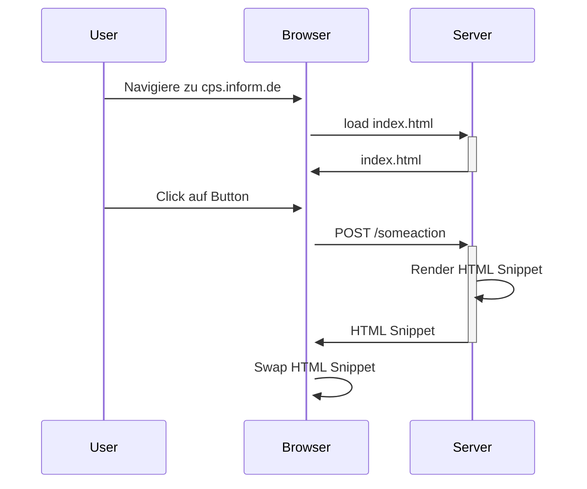

---
# try also 'default' to start simple
theme: default
title: HTMX Workshop
class: text-center
# https://sli.dev/features/drawing
drawings:
  persist: true
transition: slide-left
mdc: true
---

# HTMX Workshop


<!-- 
- high powered tools for html
- Vorstellungsrunde
-->

---

# Was ist HTMX

"High powered toosl for HTML"

```html
<button hx-get="/api/data" hx-target="#result">
  Load Data
</button>
<div id="result"></div>
```
<br/>
<br/>

<v-clicks>

- HTTP Request auf getriggert durch jedes event
- auf jedem HTML element
- sehr simpel auf der Clientseite
- Komplexer auf der Serverseite

</v-clicks>

<!-- 
- 
 -->

---

# Warum HTMX


<v-clicks>

- **Einfachheit**: HTML schreiben statt JavaScript
- **Server-Side Rendering**: Volle Kontrolle über HTML-Generierung
- **Weniger JavaScript**: Kleinerer Bundle, weniger Komplexität
- **Progressive Enhancement**: Funktioniert mit bestehenden Frameworks
- **Hypermedia-Driven**: REST-Prinzipien konsequent umgesetzt

</v-clicks>


--- 

# Der alte Weg

```html
<form action="/contact" method="POST">
  <input name="email" type="email" />
  <button type="submit">Subscribe</button>
</form>
```

<v-clicks>

**Problem:** Komplette Seite wird neu geladen ↻

**SPA-Lösung:** React/Vue + REST API + JSON + Client-Side Rendering


```jsx
const [email, setEmail] = useState('')

const handleSubmit = async (e) => {
  e.preventDefault()
  const response = await fetch('/api/contact', {
    method: 'POST',
    headers: { 'Content-Type': 'application/json' },
    body: JSON.stringify({ email })
  })
  const data = await response.json()
  // Update DOM manually
}
```

</v-clicks>

---

# Mit HTMX

<v-clicks>

```html
<form hx-post="/contact" hx-target="#message">
  <input name="email" type="email" />
  <button type="submit">Subscribe</button>
</form>

<div id="message"></div>
```

**Server antwortet mit HTML:**

```html
<div class="success">
  ✓ Vielen Dank! Sie haben sich erfolgreich angemeldet.
</div>
```

</v-clicks>

---

# Wo ist HTMX nützlich?
<br />
<br />


---

# Workshop Überblick Tag 1

**9:30 - 10:00** Intro und Überblick
- HTMX Attribute
- Request Lifecyle
- Request und Response Header

**10:30 - 10:45** Kleine Warmup-Übung

**10:45 - 11:00** Kaffepause

**11:00 - 11:45** Fortgeschrittene Attribute & Patterns

- Trigger (Events, Filter, Modifier)
- Custom Request Parameter
- Loading States & Indicators
- Confirmation Dialogs

**11:45 - 12:30** Mittagspause

--- 

# Workshop Überblick Tag 1

**12:30 - 13:15** Übung 2 -> Interaktive Task Liste

**13:15 - 13:45** Forms & Validation

- Formular Submission
- Validation Patterns & Error Display
- Field-Level Validation

**13:45 - 14:15** Übung 3 -> Forms und Validation

**14:15 - 14:30** Kaffepause

**14:30 - 15:00** State Management

- URLs, History API & Sessions
- Boosting
- Redirects

**15:00 - 15:30** Übung 4 -> Multi Step Wizard mit JTE

--- 

# Workshop Überblick Tag 1

**15:30 - 16:15** HTMX Events & Advanced Patterns

- Lifecycle Events und Custom Events
- Out-of-Band Swaps
- Web Components

**16:15 - 16:45** Übung 5 Live Search
**16:45 - 17:00** Recap

- Zusammenfassung
- Kotlinx HTML als Alternative

**17:00 - 17:30** Fragen und Wünsche für Tag 2

--- 

# Workshop Überblick Tag 2

**9:00 - 9:30**

- HTTP Error Codes
- Error Feedback Patterns
- Retries

**9:30 - 10:00** Übung 6 Error Handling

**10:00 - 10:15** Kaffeepause

**10:15 - 10:45** Real Time Updates

- Polling, Websockets & SSE

**10:45 - 11:45** Übung 7 Live Notifications

**11:45 - 12:30** Mittagspause

**12:30 - 13:00** Fortgeschrittene UI Pattern

- Lazy Loading & Infinte Scroll
- Modals & Overlays (HTML5 Tricks)
- Optimistic UI

**13:00 - 13:30** Übung 8 Infinite Scroll

--- 

# Workshop Überblick Tag 2

**13:30 - 14:00** Data Tables

- Sorting, Filtering & Pagination
- Caching
- Debounce & Throttle

**14:00 - 14:30** Übung 9 Data Tables

**14:30 - 14:45** Kaffepause

**14:45 - 17:15** Open Workshop

**17:15 - 17:30** Wrapup & Feedback

---

# Vorraussetzungen

- JDK 21+
- Gradle (IntelliJ regelt)
- Browser mit Devtools

---
layout: two-cols-header
---

# Intro und Überblick

::left::



::right::

<v-clicks>

- User navigiert zu Seite
- Browser requested HTML
- Server antwortet mit gesamter Seite
- User Clickt auf Button und HTMX macht AJAX Post
- Server rendert und Antwortet mit einem HTMl Snippet
- HTMX Swapped DOM Nodes

</v-clicks>

---

# Beispiel

<v-clicks>

```html
<!-- Initial HTML vom Server -->
<div id="counter">Count: 0</div>
<button hx-post="/increment" 
        hx-target="#counter"
        hx-swap="innerHTML">
  Increment
</button>
```

**Server Response (HTML Snippet):**

```html
Count: 1
```

**Result:** HTMX ersetzt nur den Inhalt von `#counter`, keine komplette Page Reload!

</v-clicks>


---

# Technische Details

<v-clicks>

- **Dateigröße**: ~14kb minified + gzipped
  - Zum Vergleich: React ~40kb+, Vue ~30kb+
- **Browser-Kompatibilität**: Alle modernen Browser (IE11+)
- **Installation**: 
  - Via CDN (kein Build-Step notwendig)
  - Via npm/yarn für Build-Prozesse
- **Performance**: 
  - Weniger JavaScript → Schnelleres Parsing
  - Server-Side Rendering → Schnellere First Paint
  - Weniger Bundle-Size → Schnellere Downloads

</v-clicks>

---

# Philosophie & Konzepte

<v-clicks>

**HATEOAS** (Hypermedia as the Engine of Application State)
- Server kontrolliert Navigation und UI-Zustand durch Hypermedia (HTML)
- Client muss keine Business-Logik kennen

**Locality of Behavior** 
- Code ist dort wo er gebraucht wird - direkt im HTML
- Keine Trennung zwischen Markup und Verhalten über Dateien hinweg

**Progressive Enhancement**
- Funktioniert ohne JavaScript (Fallback auf normale Forms)
- JavaScript erweitert die Funktionalität schrittweise
- Graceful Degradation automatisch

</v-clicks>

---

# Kombinierbarkeit mit JavaScript

**Interactive Islands Pattern**

```html
<!-- HTMX für Datenaustausch -->
<div hx-get="/products" hx-trigger="load">
  <!-- Alpine.js für lokale Interaktivität -->
  <div x-data="{ count: 0 }">
    <button @click="count++">Count: <span x-text="count"></span></button>
  </div>
</div>
```

- HTMX übernimmt Server-Kommunikation
- Alpine.js, Vanilla JS für lokale UI-Logik
- Best of both worlds: Server-State + Client-State
- Bibliotheken wie Alpine.js, Petite-Vue, _hyperscript perfekt kombinierbar


---

# SPA vs. MPA vs. HTMX Hybrid

<div class="grid grid-cols-3 gap-4 text-sm">

<div>

**SPA** 
(React, Vue, Angular)

<v-clicks>

✅ Sehr interaktiv  
✅ App-like Feel  
✅ Client-State Management

❌ Große Bundle-Size  
❌ Komplexer Build  
❌ SEO Herausforderungen  
❌ Hohe Komplexität

</v-clicks>

</div>

<div>

**MPA** 
(Traditional Server-Side)

<v-clicks>

✅ Einfach  
✅ SEO-friendly  
✅ Schnelle First Paint

❌ Page Reloads  
❌ Kein State  
❌ Langsames UX

</v-clicks>

</div>

<div>

**HTMX Hybrid**

<v-clicks>

✅ Partial Updates  
✅ Einfachheit  
✅ SEO-friendly  
✅ Progressive Enhancement  
✅ Kleine Bundle-Size

⚠️ Weniger für hochinteraktive Apps  
⚠️ Server-Rendering notwendig

</v-clicks>

</div>

</div>

---

# HTMX Request Attribute

<v-clicks>

- `hx-get`, `hx-post`, `hx-put`, `hx-patch`, `hx-delete` - HTTP Methode & URL
- `hx-trigger` - Welches Event löst den Request aus (default: `click` bei Button, `change` bei Input)
- `hx-include` - Zusätzliche Elemente in Request einbeziehen
- `hx-params` - Welche Parameter sollen mitgeschickt werden
- `hx-target` - Welches Element wird aktualisiert (default: Element selbst)
- `hx-swap` - Wie wird der Content eingefügt (`innerHTML`, `outerHTML`, `beforebegin`, `afterend`, etc.)
- `hx-swap-oob` - Out-of-Band Swaps für mehrere Elemente gleichzeitig
- `hx-indicator` - Loading Indicator anzeigen während Request läuft
- `hx-confirm` - Bestätigungsdialog vor Request anzeigen

</v-clicks>

---

# HTMX Response Attribute

<v-clicks>

- `HX-Trigger` - Löst Events auf dem Client aus nach Response
- `HX-Retarget` - Ändert das Ziel-Element für den Swap
- `HX-Reswap` - Ändert die Swap-Strategie für die Response
- `HX-Redirect` - Führt einen Client-seitigen Redirect durch
- `HX-Refresh` - Refresht die komplette Seite
- `HX-Location` - Client-seitiger Redirect mit HTMX Request
- `HX-Push-Url` - Updated die Browser URL (History API)
- `HX-Replace-Url` - Ersetzt die Browser URL ohne History Eintrag

</v-clicks>

---

# HTMX Request & Response Header

<div class="grid grid-cols-2 gap-8">

<div>

**Request Header (Browser → Server):**

<v-clicks>

- `HX-Request: true` - Kennzeichnet HTMX Request
- `HX-Trigger` - ID des auslösenden Elements
- `HX-Trigger-Name` - Name des auslösenden Elements
- `HX-Target` - ID des Ziel-Elements
- `HX-Current-URL` - Aktuelle URL im Browser
- `HX-Prompt` - Wert aus Prompt Dialog

</v-clicks>

</div>

<div>

**Response Header (Server → Browser):**

<v-clicks>

- `HX-Trigger` - Events triggern nach Swap
- `HX-Redirect` - Client-Redirect durchführen
- `HX-Refresh` - Seite neu laden
- `HX-Push-Url` - URL in History pushen
- `HX-Retarget` - Anderes Ziel wählen
- `HX-Reswap` - Swap-Methode ändern

</v-clicks>

</div>

</div>

---

# Übung 1 - Warmup

Baut eine kleine HTMX App mit Thymeleaf und Spring MVC